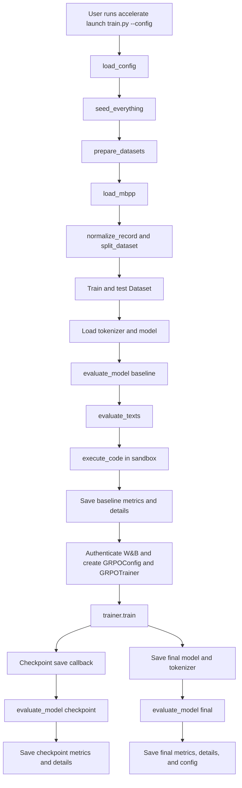

# post-training

This repository contains a small GRPO experiment that trains `Qwen/Qwen3.5-0.8B` to generate Python solutions for MBPP.

## Setup

```bash
python -m pip install -r requirements.txt
```

The first run downloads the model and MBPP from Hugging Face. A CUDA-capable environment is recommended. Copy `.env.example` to `.env` and set `WANDB_API_KEY`; `.env` is ignored by Git and must never be committed.

## Run

```bash
accelerate launch --num_processes 1 train.py --config configs/debug.yaml
accelerate launch --num_processes 1 train.py --config configs/default.yaml
```

The debug configuration limits the dataset and training steps. Each run writes its configuration, baseline metrics, checkpoint metrics, final metrics, per-example details, and model artifacts under its configured `output_dir`.

## Data and reward

`data.py` loads MBPP, normalizes task descriptions and assertions, and creates a deterministic 80/20 train-test split. No validation set is used. `sandbox.py` executes each generated candidate in a timed isolated-mode subprocess. A candidate receives reward `1.0` only when all supplied assertions pass; syntax errors, failed assertions, empty responses, and timeouts receive `0.0`.

W&B logging is enabled by default. TRL logs reward, reward variance, loss, gradient norm, entropy, completion lengths, clipping, token counts, learning rate, and step time. The project additionally logs baseline, checkpoint, and final pass@1, average reward, and execution status counts to W&B. Baseline evaluation runs before training, checkpoint evaluation runs on saves, and final evaluation runs after training.

The subprocess sandbox is intended for local experiments. It is not a production-grade hostile-code isolation boundary; use containers or a separate execution service for untrusted workloads.

## Execution flow


